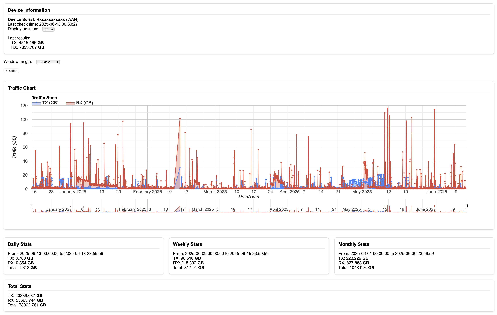

# Simple Mikrotik Traffic Counter
A simple PHP application to collect interface statistics from Mikrotik router and display the usage (upload/download).
You can host this application anywhere on the network or Internet.

The difference from original version:
Script collects TX/RX from the choosen interface w/o firewall rules.

### Features
- Collect tx/rx stats from routerboard's interface.
- Display hourly graph.
- Display daily/weekly/monthly summary.

## Usage
Setup the Mikrotik router to collect and send the stats to the application first.

1. Add the following script that will get the data and send it to the application.
```
:local sysnumber [/system routerboard get value-name=serial-number]
:local iface "ether3"
:local txbytes ([/interface get [find name=$iface] tx-byte])
:local rxbytes ([/interface get [find name=$iface] rx-byte])
/tool fetch url=("http://<server ip/url>/collector.php\?sn=$sysnumber&tx=$txbytes&rx=$rxbytes&delta=true") mode=http keep-result=no
:log info ("Traf data sent for $iface, tx $txbytes, rx $rxbytes")
```
Edit the `<server ip/url>` to match where application is hosted.

3. Set a scheduler to run the script at 1 hour intervals.
```
/system scheduler add name="upload-traffic-count-local" interval=1h on-event=<script name>
```
Edit the `<script name>` to match the actual script.

4. View in application after script is run.

## Sample Screenshot


## Inspired by 
https://github.com/muhannad0/mikrotik-traffic-counter

## Acknowledgements
- [tikstat](https://github.com/mrkrasser/tikstat) project
- [Mikrotik: WAN Data Monitoring via Scripting](https://aacable.wordpress.com/2015/03/09/5386/) by Syed Janazaib
