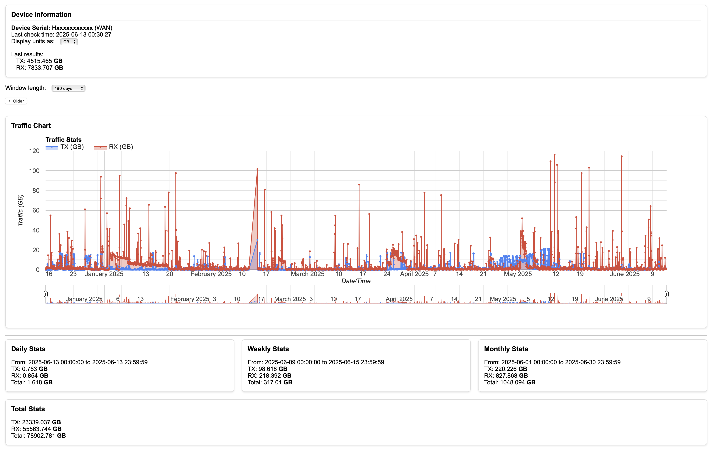

# Mikrotik Traffic Counter v2

PHP 8.3 application for collecting MikroTik interface counters and visualizing traffic per device and per interface.  
The v2 branch is a clean break from the legacy schema and now supports:

- configuration through environment variables with `.env` fallback
- SQLite or MySQL through PDO
- per-device and per-interface traffic storage
- async frontend without page reloads
- optional collector token auth
- optional collector source-IP allowlist
- PHPUnit coverage for config, guards, and traffic services
- legacy SQLite export for migration

## Project Layout

The active web root is `public/`.

Key paths:

- `public/index.php` SPA shell
- `public/api.php` JSON API entrypoint
- `public/collect/index.php` collector endpoint behind `/collect`
- `public/assets/app.js` async frontend logic
- `public/assets/app.css` frontend styles
- `src/` application code: config, database, HTTP, controllers, models, services, support
- `tests/` PHPUnit coverage
- `scripts/export-legacy-sqlite.php` legacy SQLite exporter
- `scripts/import-legacy-json.php` legacy JSON importer

Compatibility wrappers still exist in `src/index.php` and `src/api.php`, but they are only shims and not the intended deployment entrypoints.

The UI is written to work both at the web root and under a subfolder deployment, as long as the web server points that subfolder at `public/`.

## Requirements

- PHP 8.3+
- `pdo_sqlite` for SQLite deployments
- `pdo_mysql` for MySQL deployments
- Composer

## Configuration

All runtime configuration is centralized in [configuration.php](/workspace/mikrotik-traffic-counter/configuration.php) and loaded from real environment variables first, then `.env`.

Start from:

```bash
cp .env.example .env
```

Important settings:

- `DB_DRIVER=sqlite` or `mysql`
- `DB_SQLITE_PATH=var/database/tikstats.sqlite`
- `DB_MYSQL_HOST`, `DB_MYSQL_PORT`, `DB_MYSQL_DATABASE`, `DB_MYSQL_USERNAME`, `DB_MYSQL_PASSWORD`
- `AUTH_ENABLED=true|false`
- `AUTH_TOKEN=...`
- `SOURCE_IP_ENABLED=true|false`
- `SOURCE_IP_ALLOWLIST=127.0.0.1,10.0.0.5`
- `APP_TIMEZONE=UTC`
- `DEFAULT_WINDOW_HOURS=48`

## Local Run

Install dependencies:

```bash
composer install
```

Run with PHP’s built-in server:

```bash
php -S 127.0.0.1:8080 -t public
```

Then open:

```text
http://127.0.0.1:8080
```

Subfolder deployments are also supported, for example:

```text
https://example.com/mikrotik/
```

## Docker

The Docker setup is aligned with PHP 8.3 and mounts the whole repository so the root-level configuration files are available in the container.

SQLite mode:

```bash
docker compose up --build
```

MySQL mode:

```bash
docker compose --profile mysql up --build
```

MySQL data is stored in the project-local `./mysql_data` directory.

If using MySQL through Docker, set:

```dotenv
DB_DRIVER=mysql
DB_MYSQL_HOST=mysql
DB_MYSQL_PORT=3306
DB_MYSQL_DATABASE=tikstats
DB_MYSQL_USERNAME=tikstats
DB_MYSQL_PASSWORD=secret
```

The nginx container serves `public/` as the document root. It also:

- denies access to `.env`, `.git`, and database files
- adds a few baseline security headers

## Release Build

If you deploy with FTP, SCP, or `rsync`, it is easier to build a clean release directory first instead of uploading the whole repository.

Prepare production dependencies:

```bash
composer install --no-dev --optimize-autoloader
```

Build a release directory:

```bash
bash scripts/build-release.sh
```

Or do both in one step:

```bash
bash scripts/build-release.sh --composer-install
```

This creates:

```text
build/release
```

The release build keeps runtime files such as:

- `public/`
- `src/`
- `vendor/`
- `configuration.php`
- `.env.example`
- `var/`

It excludes development-only or local-only content such as:

- `.git/`
- `tests/`
- `docker/`
- `mysql_data/`
- local `var/` contents
- docs and screenshots

After building the release:

1. copy your real `.env` into `build/release`
2. upload `build/release`
3. configure the web server document root to `public/`

If deploying under a subfolder instead of the domain root, point that subfolder to `public/`. Relative asset and API URLs are intended to work in both cases.

## Collector Endpoint

Collector ingestion is implemented in:

```text
/collect
```

Required query parameters:

- `sn`
- `interface`
- `tx`
- `rx`

Optional query parameters:

- `delta=true`
- `auth=<token>` when `AUTH_ENABLED=true`

Example collector request:

```text
http://<server>/collect?sn=ABC123456789&interface=ether1&tx=1000&rx=2000&delta=true
```

Fallback direct API request:

```text
http://<server>/api.php?action=collect&sn=ABC123456789&interface=ether1&tx=1000&rx=2000&delta=true
```

## MikroTik Example

```routeros
:local sysnumber [/system routerboard get value-name=serial-number]
:local iface "ether3"
:local txbytes ([/interface get [find name=$iface] tx-byte])
:local rxbytes ([/interface get [find name=$iface] rx-byte])
/tool fetch url=("http://<server>/collect\?sn=$sysnumber&interface=$iface&tx=$txbytes&rx=$rxbytes&delta=true") mode=http keep-result=no
:log info ("Traffic data sent for $iface, tx $txbytes, rx $rxbytes")
```

With auth enabled:

```routeros
:local sysnumber [/system routerboard get value-name=serial-number]
:local iface "ether3"
:local txbytes ([/interface get [find name=$iface] tx-byte])
:local rxbytes ([/interface get [find name=$iface] rx-byte])
:local token "replace_me"
/tool fetch url=("http://<server>/collect\?sn=$sysnumber&interface=$iface&tx=$txbytes&rx=$rxbytes&delta=true&auth=$token") mode=http keep-result=no
```

Scheduler example:

```routeros
/system scheduler add name="upload-traffic-count-local" interval=1h on-event=<script name>
```

## API Summary

Current API actions:

- `collect`
- `getDevices`
- `getDeviceData`
- `listInterfaces`
- `renameDevice`
- `updateDevice`
- `deleteDevice`

Useful examples:

```text
/api.php?action=getDevices
/api.php?action=getDeviceData&id=1&interface_id=2&window=48&offset=0
/api.php?action=updateDevice&id=1&name=Office%20Router&comment=WAN%20uplink
```

Notes:

- `window` defaults to `DEFAULT_WINDOW_HOURS`
- `window` is bounded to prevent excessively heavy queries
- `offset` pages through older windows of the same size
- collector auth is enforced only when `AUTH_ENABLED=true`
- source IP allowlisting is enforced only when `SOURCE_IP_ENABLED=true`

## Testing

Run the PHPUnit suite:

```bash
composer test
```

Run the MySQL-backed test path by providing a disposable MySQL database:

```bash
TEST_MYSQL_HOST=127.0.0.1 \
TEST_MYSQL_PORT=3306 \
TEST_MYSQL_DATABASE=tikstats_test \
TEST_MYSQL_USERNAME=tikstats \
TEST_MYSQL_PASSWORD=secret \
composer test
```

Current coverage includes:

- configuration precedence and validation
- auth and source-IP request guards
- device/interface creation and delta-based traffic aggregation
- optional MySQL-backed service flow when `TEST_MYSQL_*` variables are configured

If the `TEST_MYSQL_*` variables are not configured, the MySQL integration test is skipped by design.

## Legacy Migration

v2 does not reuse the legacy schema in place.  
Export the legacy SQLite file first, then import or transform the JSON into the new environment.

Export command:

```bash
php scripts/export-legacy-sqlite.php src/tikstats.sqlite /tmp/legacy-export.json legacy
```

Arguments:

1. legacy SQLite path
2. output JSON path
3. optional interface name for imported legacy samples, defaults to `legacy`

The export contains:

- `devices`
- `interfaces`
- `traffic_samples`

Legacy traffic rows are exported as delta-only samples because the old schema does not retain raw counters.

Import the exported JSON into a fresh v2 database with your normal `.env` / environment configuration:

```bash
php scripts/import-legacy-json.php /tmp/legacy-export.json
```

Docker-oriented examples:

Export from inside the PHP container:

```bash
docker compose run --rm php php scripts/export-legacy-sqlite.php src/tikstats.sqlite /tmp/legacy-export.json legacy
```

Copy the export out if needed:

```bash
docker compose run --rm php sh -lc 'cp /tmp/legacy-export.json var/legacy-export.json'
```

Import into a fresh SQLite-backed v2 database in Docker:

```bash
docker compose run --rm php php scripts/import-legacy-json.php /tmp/legacy-export.json
```

Import into a MySQL-backed v2 database in Docker:

```bash
docker compose --profile mysql run --rm \
  -e DB_DRIVER=mysql \
  -e DB_MYSQL_HOST=mysql \
  -e DB_MYSQL_PORT=3306 \
  -e DB_MYSQL_DATABASE=tikstats \
  -e DB_MYSQL_USERNAME=tikstats \
  -e DB_MYSQL_PASSWORD=secret \
  php php scripts/import-legacy-json.php /tmp/legacy-export.json
```

The importer:

- creates or updates devices by serial number
- creates interfaces by `(device, interface name)`
- imports legacy traffic rows as explicit delta samples
- adds a synthetic zero-delta snapshot when legacy `last_tx` / `last_rx` are available so the v2 UI can show sensible last-counter values

The runtime application itself does not read the legacy schema. Migration is intentionally out-of-band.

After import, older traffic may not appear in the default chart immediately if it falls outside `DEFAULT_WINDOW_HOURS`. Device totals and interface data will still be present; use a larger `window` or page further back with `offset`.

## Current Status

Implemented on `v2`:

- central configuration bootstrap
- SQLite and MySQL PDO database layer
- normalized schema for devices, interfaces, and traffic samples
- controller and HTTP request/response layer
- consolidated collector handling in `public/api.php`
- optional auth and source-IP protection
- async frontend with interface-aware views
- split frontend assets under `public/assets/`
- PHPUnit tests, including optional MySQL coverage
- legacy export and import tooling

Recommended validation before production use:

- run the full stack end-to-end in Docker
- review the UI in a real browser
- verify MySQL-backed tests end-to-end in an environment with MySQL available
- send real MikroTik collector requests against `/collect`

## Suggested Full-Stack Validation

1. Start SQLite mode with `docker compose up --build`.
2. Open `http://127.0.0.1/` and verify the UI loads.
3. Send a few collector requests to `/collect` with different interface names for the same serial number.
4. Verify:
   - the device appears in the list
   - per-interface selection works
   - charts update without reload
   - rename/comment updates persist
5. Repeat with auth enabled.
6. Repeat with source IP allowlisting enabled.
7. Switch to MySQL config and run `docker compose --profile mysql up --build`.
8. Run the PHPUnit suite again with `TEST_MYSQL_*` variables configured.

## Screenshot

Reference screenshot from the older UI:



## Inspired By

https://github.com/muhannad0/mikrotik-traffic-counter

## Acknowledgements

- [tikstat](https://github.com/mrkrasser/tikstat) project
- [Mikrotik: WAN Data Monitoring via Scripting](https://aacable.wordpress.com/2015/03/09/5386/) by Syed Janazaib
